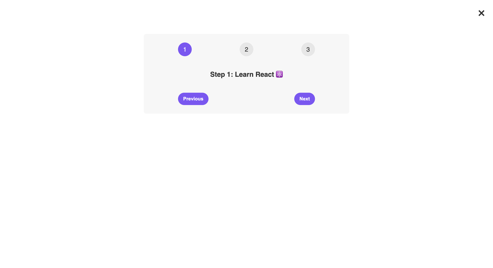

# **Walkthrough - Steps Counter**

This is a small walkthrough project in the "State, Events, and Forms: Interactive Components" section of "The Ultimate React Course 2023: React, Redux & More" by Jonas Schmedtmann.

## **1. Practiced Skills**

The goal of the project was to learn about state, in particular with regard to the three key steps of:

- Creating a state variable and a related function to update it.
- Using the state variable's value.
- Updating the state variable's value.

The app features three numbered circles, each one connected to a "Step no.: ..." short text beneath them. Underneath, the user can find the "Previous" and "Next" buttons, which move forward or backward through the steps according to the step's state.  
In addition, an X can be found in the top-right corner of the screen, which shows or hides the entire content of the page when clicked.